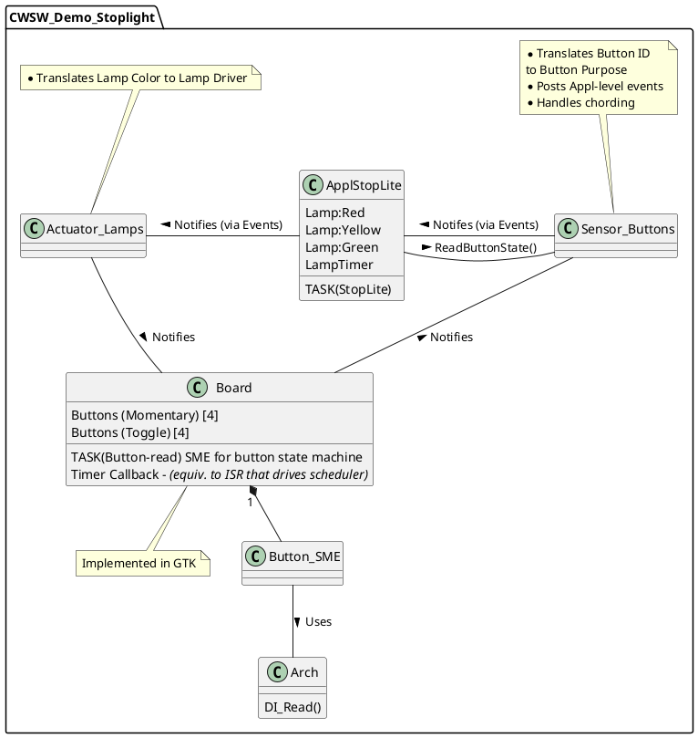
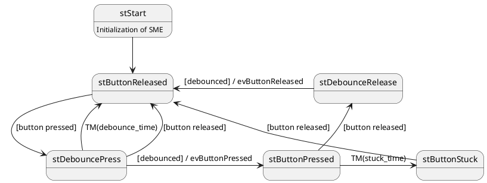

This folder is the home for the Eclipse (Windows) project - actually, "cevelop"

```plantuml
@startuml

namespace CWSW_Demo_Stoplight {

class Sensor_Buttons {
}
note "* Translates Button ID\nto Button Purpose\n* Posts Appl-level events\n* Handles chording" as ApplButtonSnsrNote
Sensor_Buttons .u. ApplButtonSnsrNote

class Actuator_Lamps {
}
note "* Translates Lamp Color to Lamp Driver" as ActuatorLampsNote
Actuator_Lamps .u. ActuatorLampsNote

class ApplStopLite {
    {field} Lamp:Red
    {field} Lamp:Yellow
    {field} Lamp:Green
    {field} LampTimer
    {method} TASK(StopLite)
}

Actuator_Lamps - Board: Notifies >

class Board {
    {field} Buttons (Momentary) [4]
    {field} Buttons (Toggle) [4]
    {method} TASK(Button-read) SME for button state machine
    {method} Timer Callback - <i>(equiv. to ISR that drives scheduler)</i>
}
note "Implemented in GTK" as BoardGtkNote
Board .. BoardGtkNote 

class Button_SME {
}

class Arch {
    {method}DI_Read()
}

Board "1" *-- Button_SME

Button_SME -d- Arch: Uses >
Board -u- Sensor_Buttons: Notifies >

ApplStopLite - Sensor_Buttons: Notifes (via Events) <
ApplStopLite -l- Actuator_Lamps: Notifies (via Events) >
ApplStopLite -d- Sensor_Buttons: ReadButtonState() >

}
@enduml

```

```plantuml
@startuml

stStart -d-> stButtonReleased
stStart: Initialization of SME
stButtonReleased -d-> stDebouncePress: [button pressed]
stDebouncePress -r-> stButtonPressed: [debounced] / evButtonPressed
stButtonPressed -u-> stDebounceRelease: [button released]
stDebounceRelease -l-> stButtonReleased: [debounced] / evButtonReleased

stDebouncePress -> stButtonReleased: TM(debounce_time)
stDebouncePress -> stButtonReleased: [button released]

stButtonPressed -> stButtonStuck: TM(stuck_time)
stButtonStuck -> stButtonReleased: [button released]

@enduml

```

stDebounceRelease -d-> stButtonPressed: [button pressed]
stDebounceRelease -> stButtonStuck: TM(debounce_time)
